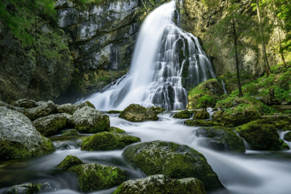

# TorchSR
An easy-to-use SRGAN-based Super Resolution tool using PyTorch to upscale
images by 4x in each direction.

## System Requirements
The following hardware and software versions are required to properly use this
repository:

* Python Version: 3.7 or newer (including PIP)
* PyTorch Version: 1.10.0 or newer (`torchrun` binary required for distributed)
* Pillow Version: 7.1.2 or newer
* Scikit-Learn Version: 0.18.2 or newer
* Operating System: Linux-based (tested on Ubuntu 20.04)
* Recommended CPU Cores: 4 or higher
* Recommended system Memory: 16GB or higher
* Docker Version: 19.03 or newer (if using Docker)

The application also supports TensorBoard for performance and accuracy metrics.
If desired, TensorBoard 2.1.0 or newer can be installed to monitor these
metrics.

### GPU Requirements
GPUs can dramatically improve performance by 10x or more. This repository only
supports recent GPUs from NVIDIA with the following requirements:

* CUDA Version: 10.0 or newer
* Driver Version: 450 or newer
* GPU Architecture: Volta or newer
* Recommended GPU Memory: 8GB or higher
* NVIDIA Container Runtime (if using Docker)

For multi-GPU communication over NCCL, NVLink is highly recommended.

## Setup
To train a new model, a dataset needs to be downloaded and extracted locally.
While most any dataset can be used, it is recommended to download both DIV2K
and FLICKR2K into a single directory for a broad dataset. TorchSR handles the
data preprocessing so only the high resolution images from each dataset are
needed for training and the downloaded low resolution images can be ignored. To
download and extract the datasets, run the following steps (the download may
take a while depending on network speeds):

```bash
# Download the datasets
wget http://data.vision.ee.ethz.ch/cvl/DIV2K/DIV2K_train_HR.zip
wget http://cv.snu.ac.kr/research/EDSR/Flickr2K.tar
# Extract both datasets
unzip DIV2K_train_HR.zip
tar -xvf Flickr2K.tar
# Create a directory to save the dataset to
mkdir -p dataset
# Transfer all images to the dataset directory
mv DIV2K_train_HR/*.png dataset/
mv Flickr2K/Flickr2K_HR/*.png dataset/
# Cleanup all archives
rmdir DIV2K_train_HR
rm DIV2K_train_HR.zip
rm -rf Flickr2K
rm Flickr2K.tar
```

**NOTE:** While most any high-resolution dataset can be used for training, it is
recommended to only use images saved in the PNG format as JPEGs can introduce
artifacts on the images due to their lossy nature.

### Installation
Install all dependencies listed in the `requirements.txt` file with `pip`:

```bash
pip3 install -r requirements.txt
```

Next, to make it easier to use the application, a Python wheel can be built and
installed. To build the package, run the following:

```bash
python3 setup.py bdist_wheel
```

This will create a `dist/` directory locally which contains the newly built
Python wheel. Install the wheel with:

```bash
pip3 install dist/torchsr-*.whl
```

Verify the package was installed correctly with:

```
$ torchsr --help
usage: torchSR Version: 0.1.0 [-h] [--local_rank N] function ...

positional arguments:
  function
    train         Train an SRGAN model against an HD dataset.
    test          Generated a super resolution image based on a trained SRGAN model.

optional arguments:
  -h, --help      show this help message and exit
  --local_rank N  Rank for the local process. Used for distributed training.
```

The remainder of the documentation assumes the Python wheel has been built and
installed. If running the code directly from source and not using the wheel,
replace any `torchsr ...` commands below with `python3 -m torchsr.torchsr ...`
for identical functionality. Note that if any changes are made locally to the
code, the wheel will need to be rebuilt and reinstalled following the steps
above.

### Docker
The repository also supports Docker containers where the package can be prebuilt
and installed in a container with known dependencies installed. To build the
container, clone the repository and run the following inside the repository's
root directory:

```
docker build -t torchsr:0.1.0 .
```

This will build a new Docker container with the latest requirements and code.

To launch the container, run the following:

```
docker run --rm -it \
    --gpus all \  # If using GPUs
    -v /path/to/dataset:/dataset \
    --shm-size=16g \
    torchsr:0.1.0
```

Update the `-v /path/to/dataset:/dataset` to the path to where the dataset was
downloaded during the setup. This will map the directory inside the container
where it can be used freely. Omit the `--gpus all` flag if not using GPUs.

Once inside the container, the `torchsr` command is in the PATH and all commands
below will run by default.

## Running
With the application fully configured and installed, training can begin. TorchSR
attempts to automatically set as many parameters as possible to make the
application easy to use. To use the default parameters, simply run

```bash
torchsr train
```

to initiate the training process. By default, this will use the dataset saved to
`dataset/` locally and run on as many supported GPUs as possible.

### Advanced Usage
Certain parameters can be used to further tune performance and accuracy
depending on the dataset and local environment among other variables. Here are
some of the more common parameters that can be specified for different
functionality:

* `--batch-size N`: Use a different batch size from the default. While any
positive integer can be used, it is recommended to use a number that is a power
of 2 (2, 4, 8, 16, ...). In general, the higher the batch size, the faster the
training will run with diminishing returns while also increasing the amount of
memory allocated by the GPUs. If you run into memory issues, whether CPU or GPU
memory, try dropping the batch size in half and re-running.
* `--dataset-multiplier N`: TorchSR takes a single random 96x96 cropping of each
image in the training dataset in every epoch and downscales the cropping to
create a low and high resolution source. This process wastes over 99% of the
image in the dataset as everything outside of the 96x96 cropping is thrown out
for each epoch. Using the `--dataset-multiplier` flag increases the number of
random samples from each image, growing the total dataset size without
increasing on-disk requirements. The number for the multiplier is the number of
random samples to take from every image.
* `--train-dir <directory>`: If the dataset is saved in a directory other than
`dataset/`, specify the location by passing it to `--train-dir`.

### Distributed Training
TorchSR can be run on multiple GPUs to greatly accelerate training by using the
`torchrun` binary included with modern versions of PyTorch. To launch a
multi-GPU training pass, modify how the application is called by adding
`torchrun --nproc_per_node=X` before your command. For example:

```bash
# Original 1-GPU command:
torchsr train --dataset-multiplier 10

# Equivalent command running on 8 GPUs on a single node:
torchrun --nproc_per_node=8 -m torchsr.torchsr train --dataset-multiplier 10
```

While running distributed training, the dataset will be divided between each
GPU, reducing the overall time needed to complete a single epoch.

### Slurm (GPU only)
TorchSR supports running on Slurm clusters using [Pyxis](https://github.com/NVIDIA/pyxis)
and [Enroot](https://github.com/NVIDIA/enroot). To run on a Slurm cluster with
Pyxis and Enroot, build the Docker image following the steps above and push the
image to a container registry of your choice using
`docker push <image name:tag>`. To launch a training job on Slurm, create an
sbatch file named `distributed.sh` with the following contents:

```bash
#!/bin/bash
#SBATCH --exclusive
#SBATCH --ntasks-per-node=8

srun \
    --gres=gpu:8 \
    --container-image <image name:tag here> \
    --container-mounts=/path/to/dataset:/dataset \
    torchsr train \
        --train-dir /dataset \
        --dataset-multiplier 10
```

Modify the `--ntasks-per-node=X` and `--gres=gpu:X` values to match the expected
number of GPUs available per node. Replace `<image name:tag here>` with the name
specified during the Docker image build above. Replace the `/path/to/dataset`
with the location of your dataset.

To launch the Slurm job, run `sbatch --nodes=X distributed.sh` and specify the
number of nodes to run on with the `--nodes=X` flag. This will create a file in
the local directory named `slurm-XXXX.out` where `XXXX` is the job ID. This file
contains information related to the training job.

### Monitoring
To help view progress while training, a validation image is generated based on
the latest model weights after every epoch. The image is saved to the `output`
directory with the epoch number included in every filename. The image is a
royalty free image from Pixabay depicting a waterfall in nature. There are a lot
of colors and details in this model which allow for a good way to showcase model
accuracy. The images below are of the low resolution input on the left and the
upscaled image that was generated on the right.

| Low Resolution                                                    | Super Resolution                                        |
|:------------------------------------------------------------------|:-------------------------------------------------|
|  |  |

## References
This project is based on the research published in the following paper:
**Photo-Realistic Single Image Super-Resolution Using a Generative Adversarial Network**

```
@InProceedings{srgan,
    author = {Christian Ledig, Lucas Theis, Ferenc Huszar, Jose Caballero, Andrew Cunningham, Alejandro Acosta, Andrew Aitken, Alykhan Tejani, Johannes Totz, Zehan Wang, Wenzhe Shi},
    title = {Photo-Realistic Single Image Super-Resolution Using a Generative Adversarial Network},
    booktitle = {arXiv},
    year = {2016}
}
```

Additionally, this project leverages resources from a few open-source
repositories:

* SRGAN-PyTorch: https://github.com/Lornatang/SRGAN-PyTorch
* BasicSR: https://github.com/xinntao/BasicSR
